## 1. GPIO 简介

GPIO（General Purpose Input/Output）是通用输入输出口。本文以 STM32F4（[RM0090](https://www.st.com/resource/en/reference_manual/rm0090-stm32f407-advanced-armbased-32bit-mcus-stmicroelectronics.pdf) 所覆盖的型号）为例，寄存器定义和复位值以对应芯片手册为准。

- 常见配置可归纳为八种输入输出模式。
- 在 3.3 V 供电时，推挽输出电平通常接近 0 V 或 3.3 V；部分标记为 FT 的引脚可容忍 5 V 输入，但需要满足[数据手册](https://www.st.com/resource/en/datasheet/stm32f407vg.pdf)中的条件，不代表能够输出 5 V。

根据芯片手册，本文所用 STM32F4 的 GPIO 挂载在 **AHB1 总线**上。

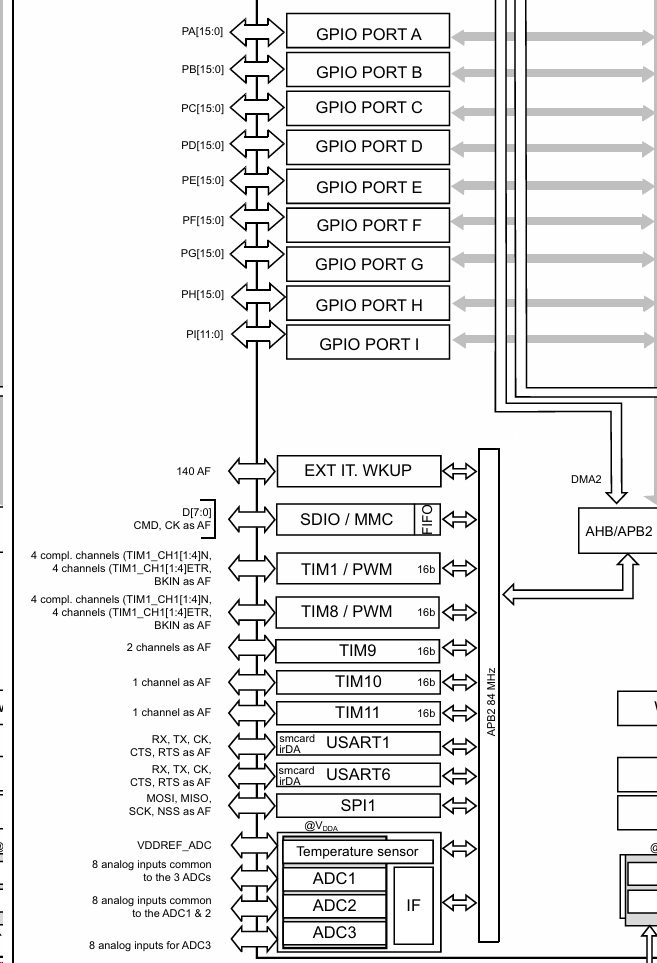

GPIO 位结构图：

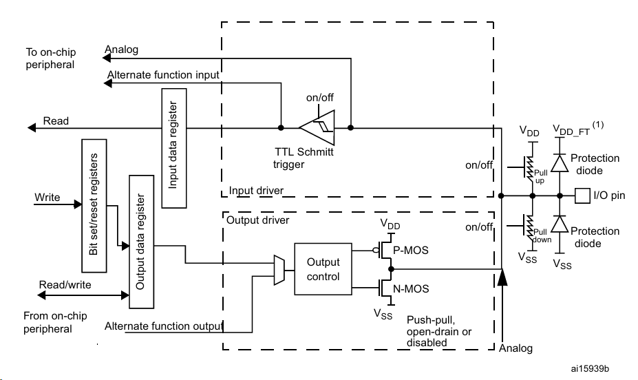

常见八种 GPIO 配置：

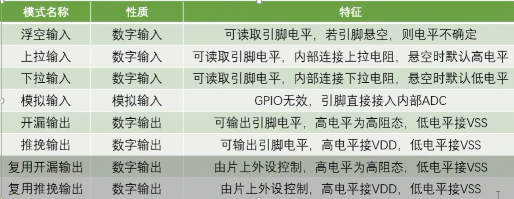

图中的“模拟输入”需结合具体引脚理解：只有具备对应 ADC 通道的引脚才能接入 ADC，设置模拟模式不会凭空增加 ADC 功能。

**推挽输出：**

- 输出 1：P-MOS 导通，将引脚拉向高电平 $V_{\mathrm{DD}}$。
- 输出 0：N-MOS 导通，将引脚拉向低电平 $V_{\mathrm{SS}}$。

**开漏输出：**

- 输出 1：关闭下拉，进入高阻态，P-MOS 不参与驱动；能否达到高电平取决于上拉等外部连接。
- 输出 0：N-MOS 导通，将引脚拉向低电平 $V_{\mathrm{SS}}$。

## 2. 寄存器介绍

### 2.1 GPIOx_MODER：引脚模式

地址偏移：`0x00`。

| 端口 | 复位值 |
| --- | --- |
| A | `0xA8000000` |
| B | `0x00000280` |
| 其他端口 | `0x00000000` |

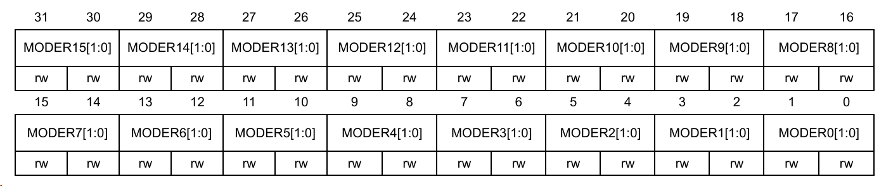

这是一个 32 位寄存器，每个引脚占用两位，决定引脚处于输入、输出、复用还是模拟模式。

| 编码 | 模式 |
| --- | --- |
| `00` | 输入模式 |
| `01` | 通用输出模式 |
| `10` | 复用功能模式 |
| `11` | 模拟模式 |

多数引脚复位后为输入模式；调试引脚存在例外，因此不能把所有引脚的复位状态都看作 `00`。

### 2.2 GPIOx_OTYPER：输出类型

地址偏移：`0x04`；复位值：`0x00000000`。

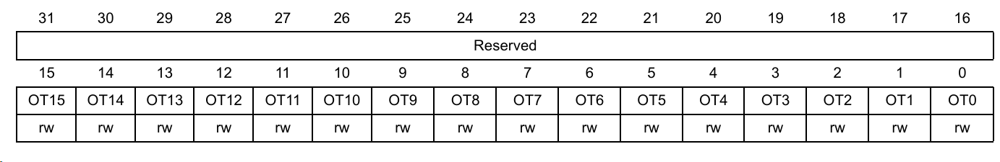

仅使用**低 16 位（位 15～0）**，每个引脚占用一位；高 16 位为保留位，必须保持复位值。

| 编码 | 输出类型 |
| --- | --- |
| `0` | 推挽输出（Push-pull） |
| `1` | 开漏输出（Open-drain） |

该寄存器决定通用输出或复用输出采用推挽还是开漏类型；在输入模式下不控制输出驱动。

### 2.3 GPIOx_BSRR：输出置位与复位（只写）

地址偏移：`0x18`；复位值：`0x00000000`。

控制 ODR 对应位的置位与复位。需要修改部分引脚时，优先使用 BSRR，以避免对 ODR 进行读—改—写带来的覆盖问题。

例如，使用 `ODR |= mask` 或 `ODR &= ~mask` 修改输出时，需要三个步骤：

1. 读取整个 ODR 寄存器。
2. 修改读取到的数据。
3. 将修改后的数据写回 ODR 寄存器。

如果在读取和写回之间发生中断，而中断又修改了 ODR 的其他位，写回旧数据时就可能覆盖中断中的修改。

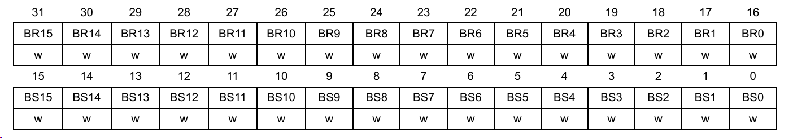

- 低 16 位：写 1，置位对应的输出位。
- 高 16 位：写 1，清除对应的输出位。
- 写 0：不产生动作。

内部过程：**CPU 写 BSRR → 更新 ODR 中的对应位**。这次写入不需要软件先读取 ODR。

### 2.4 GPIOx_PUPDR：上拉与下拉

地址偏移：`0x0C`。

| 端口 | 复位值 |
| --- | --- |
| A | `0x64000000` |
| B | `0x00000100` |
| 其他端口 | `0x00000000` |

用来设置引脚的上拉与下拉。在没有其他电路主动驱动引脚时，通过弱上拉或弱下拉电阻确定电平。

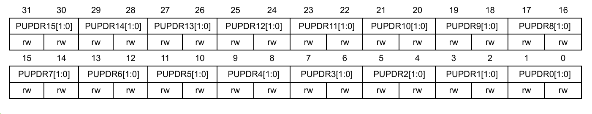

| 编码 | 配置 |
| --- | --- |
| `00` | 无上拉、无下拉 |
| `01` | 上拉 |
| `10` | 下拉 |
| `11` | 保留 |

**输入模式关闭输出驱动，但不会让引脚电压自动变成 0 V。**

还要记住：

- 推挽输出低电平时，即使开启上拉，仍然输出低电平，只会增加流经上拉电阻的电流。
- 开漏输出写 1 时释放引脚，上拉才有机会把它拉高。

### 2.5 GPIOx_OSPEEDR：输出速度

地址偏移：`0x08`。

| 端口 | 复位值 |
| --- | --- |
| A | `0x0C000000` |
| B | `0x000000C0` |
| 其他端口 | `0x00000000` |

主要调整输出驱动能力及边沿变化速度，并不是设置 GPIO 自动翻转的频率。较高速度可能增加干扰、振铃和动态功耗。

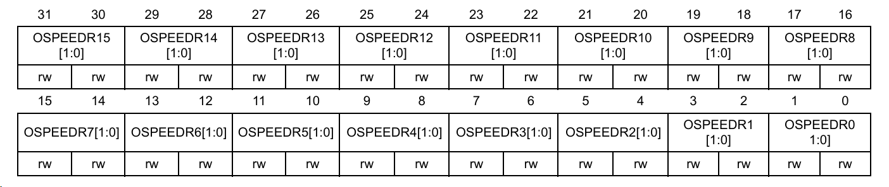

| 编码 | 速度等级 |
| --- | --- |
| `00` | 低速（Low speed） |
| `01` | 中速（Medium speed） |
| `10` | 高速（High speed） |
| `11` | 极高速（Very high speed） |

具体速度指标与供电电压、外部负载有关，应查阅对应数据手册。

**开漏输出的上升沿主要依靠上拉电阻给线路电容充电。** 在简单 RC 近似下，时间常数为：

$$
\boxed{\displaystyle \tau = R_{\text{上拉}} \times C_{\text{线路}}}
$$

其中，$R$ 的单位为 $\Omega$，$C$ 的单位为 $\mathrm{F}$，$\tau$ 的单位为 $\mathrm{s}$。$\tau$ 是充电时间常数，并非完整的上升时间。

电阻或线路电容越大，上升越慢。因此，开漏线路上升慢时，需要一起检查上拉和负载。

### 2.6 GPIOx_AFRL / GPIOx_AFRH：复用功能选择

在复用模式下，为每个引脚选择连接的外设功能。每个引脚占用 4 位，实际可选功能需查阅该芯片的复用功能表。

**AFRL 控制引脚 0～7：**

地址偏移：`0x20`；复位值：`0x00000000`。

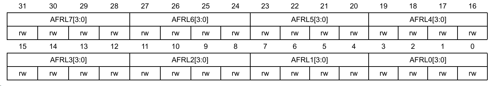

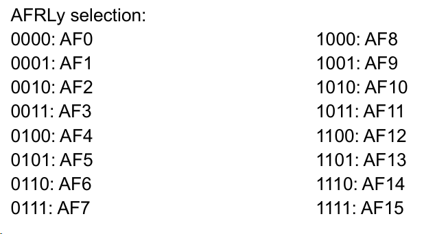

**AFRH 控制引脚 8～15：**

地址偏移：`0x24`；复位值：`0x00000000`。

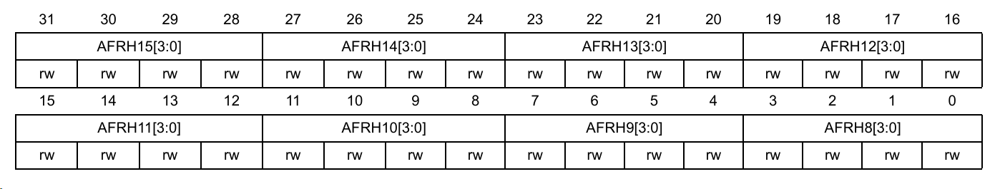

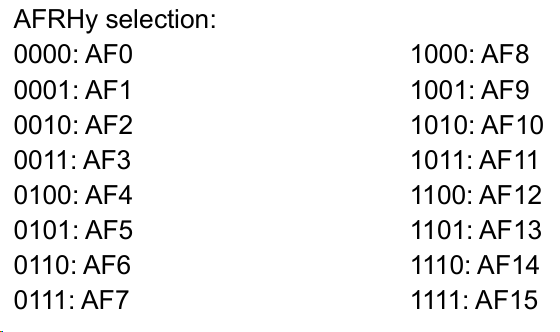

### 2.7 GPIOx_LCKR：配置锁定（无需掌握）

锁定指定引脚的配置，但输出数据仍然可以改变。

可以锁定的配置寄存器包括：`MODER`、`OTYPER`、`OSPEEDR`、`PUPDR`、`AFRL`、`AFRH`。锁定后，仍然可以通过 BSRR 改变输出状态。

地址偏移：`0x1C`；复位值：`0x00000000`；访问方式：32 位读写。

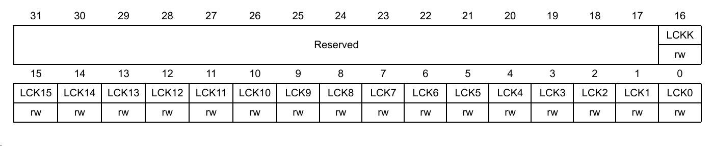

需要按照以下顺序执行。其中，`mask` 表示要锁定的引脚位，`key = 1U << 16`：

1. 写入 `LCKR = mask | key`。
2. 写入 `LCKR = mask`。
3. 写入 `LCKR = mask | key`。
4. 读取 LCKR。
5. 再次读取，检查第 16 位 LCKK 是否为 1，确认锁定成功。

锁定序列采用 **32 位访问**，三次写入中的引脚掩码必须一致。锁定成功后，需要 MCU 或相应 GPIO 外设复位才能解除。

## 3. 代码部分
正点原子STM32F407ZGT6 V3探索者中，LED均为低电平点亮，高电平熄灭。按键按下为低电平。

输入模式下，`GPIO_OType` 和 `GPIO_Speed` 不影响输入电平；按键空闲时的高电平由 `GPIO_PuPd_UP` 提供。按下和松开均进行 20 ms 消抖，每次确认按下后只翻转一次，松开后才允许再次触发。

```c
#include "stm32f4xx.h"
#include "stm32f4xx_gpio.h"
#include "stm32f4xx_rcc.h"
#include "delay.h"

void LED_Init(void)
{
    //开启GPIOF时钟
    GPIO_InitTypeDef GPIO_InitStructure;
    RCC_AHB1PeriphClockCmd(RCC_AHB1Periph_GPIOF, ENABLE);

    //提前设置高电平，让灯熄灭
    GPIO_SetBits(GPIOF, GPIO_Pin_9 | GPIO_Pin_10);

    //配置PF9, PF10
    GPIO_InitStructure.GPIO_Mode = GPIO_Mode_OUT;
    GPIO_InitStructure.GPIO_OType = GPIO_OType_PP;
    GPIO_InitStructure.GPIO_Pin = GPIO_Pin_9 | GPIO_Pin_10;
    GPIO_InitStructure.GPIO_PuPd = GPIO_PuPd_NOPULL;
    GPIO_InitStructure.GPIO_Speed = GPIO_Speed_2MHz;

    GPIO_Init(GPIOF, &GPIO_InitStructure);
}

void Key_Init(void)
{
    GPIO_InitTypeDef GPIO_InitStructure;
    RCC_AHB1PeriphClockCmd(RCC_AHB1Periph_GPIOE, ENABLE);

    GPIO_InitStructure.GPIO_Mode = GPIO_Mode_IN;
    GPIO_InitStructure.GPIO_OType = GPIO_OType_OD; // 输入模式下不影响引脚电平
    GPIO_InitStructure.GPIO_Pin = GPIO_Pin_2 | GPIO_Pin_3;
    GPIO_InitStructure.GPIO_PuPd = GPIO_PuPd_UP;
    GPIO_InitStructure.GPIO_Speed = GPIO_Speed_2MHz;

    GPIO_Init(GPIOE, &GPIO_InitStructure);
}

int main(void)
{
    LED_Init();
    Key_Init();

    // 1：允许检测新的按下；0：本次已经按下，等待松手
    uint8_t pe2_ready = 1;
    uint8_t pe3_ready = 1;

    while (1)
    {
        //检测PE2
        if (pe2_ready && GPIO_ReadInputDataBit(GPIOE, GPIO_Pin_2) == Bit_RESET)
        {
            delay_ms(20); // 按键消抖
            if (GPIO_ReadInputDataBit(GPIOE, GPIO_Pin_2) == Bit_RESET)
            {
                GPIO_ToggleBits(GPIOF, GPIO_Pin_9);
                pe2_ready = 0;
            }
        } else if (!pe2_ready && GPIO_ReadInputDataBit(GPIOE, GPIO_Pin_2) == Bit_SET)
        {
            delay_ms(20);
            if (GPIO_ReadInputDataBit(GPIOE, GPIO_Pin_2) == Bit_SET)
            {
                pe2_ready = 1;
            }
        }

        //检测PE3
        if (pe3_ready && GPIO_ReadInputDataBit(GPIOE, GPIO_Pin_3) == Bit_RESET)
        {
            delay_ms(20); // 按键消抖
            if (GPIO_ReadInputDataBit(GPIOE, GPIO_Pin_3) == Bit_RESET)
            {
                GPIO_ToggleBits(GPIOF, GPIO_Pin_10);
                pe3_ready = 0;
            }
        } else if (!pe3_ready && GPIO_ReadInputDataBit(GPIOE, GPIO_Pin_3) == Bit_SET)
        {
            delay_ms(20);
            if (GPIO_ReadInputDataBit(GPIOE, GPIO_Pin_3) == Bit_SET)
            {
                pe3_ready = 1;
            }
        }
    }
}
```


