## 1. 异步 Buck 基本拓扑

下图是异步 Buck 电路的基本拓扑，包括开关管 Q、续流二极管 D、电感 L 和输出电容 C。

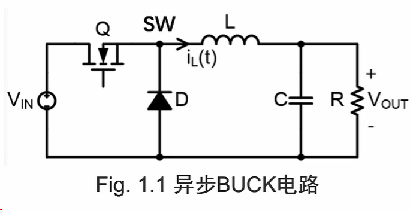

- **Q 导通时：** $V_{SW}\approx V_i$，电感储能，电感电流线性上升。
- **Q 关断时：** $V_{SW}\approx -V_d$，电感通过续流回路释放能量，电感电流线性下降。

下文统一用 $V_i$ 表示输入电压，$V_o$ 表示输出电压，$V_d$ 表示二极管正向压降；图中的 Vin、Vo 分别对应 $V_i$、$V_o$。

### 1.1 Q1 导通：电感储能

Q1 导通时，工作状态如下：

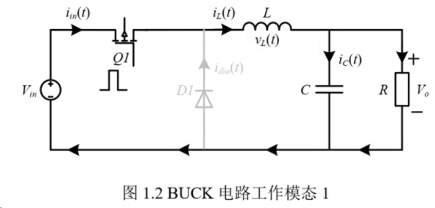

输入电源经 Q1 向电感 L 供能。忽略开关管导通压降，电感两端的电压为 $V_i-V_o$：

$$
V_i-V_o=L\frac{\mathrm{d}i_L}{\mathrm{d}t}
$$

因此，电感电流 $i_L$ 线性上升。

### 1.2 Q1 关断：二极管续流

Q1 关断后，D1 导通，电路如下：

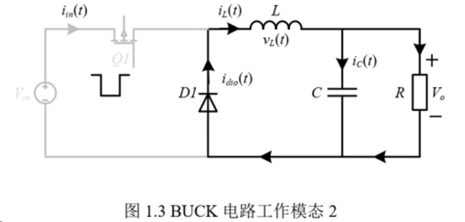

由于电感电流不能突变，其方向仍与 Q1 导通时相同，并通过 D1 形成续流回路。忽略二极管压降时，电感电压为 $-V_o$：

$$
-V_o=L\frac{\mathrm{d}i_L}{\mathrm{d}t}
$$

此时电感释放能量，$i_L$ 线性下降。考虑二极管压降后，电感电压为 $-(V_o+V_d)$；后面的参数推导采用这一表达式。

### 1.3 异步 Buck 的工作波形

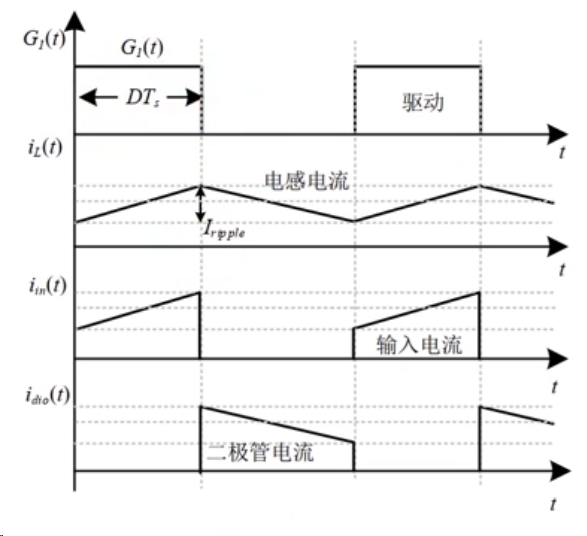

由图可见：

- **Q1 导通时：** 电感储能，输入电流 $i_{\mathrm{in}}=i_L$，二极管不导通。
- **Q1 关断时：** 电感释放能量，输入电流 $i_{\mathrm{in}}=0$，二极管电流等于电感电流。

## 2. 同步整流 Buck 电路

在异步 Buck 中，Q1 关断后由二极管续流，二极管正向压降会产生导通损耗。同步整流使用 MOSFET 替代续流二极管，利用较低的导通电阻降低这一部分损耗。

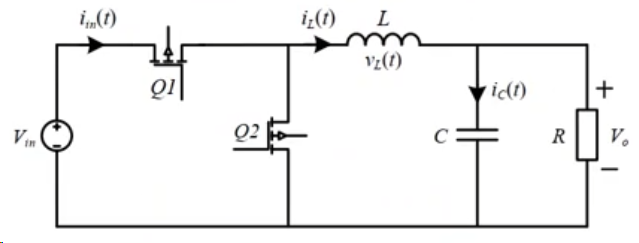

同步整流 Buck 的工作波形如下：

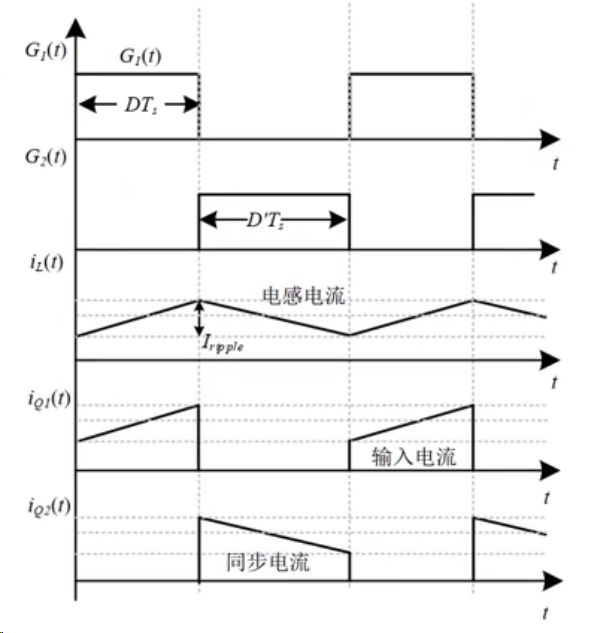

## 3. Simulink 仿真

### 3.1 异步 Buck 仿真

仿真模型：

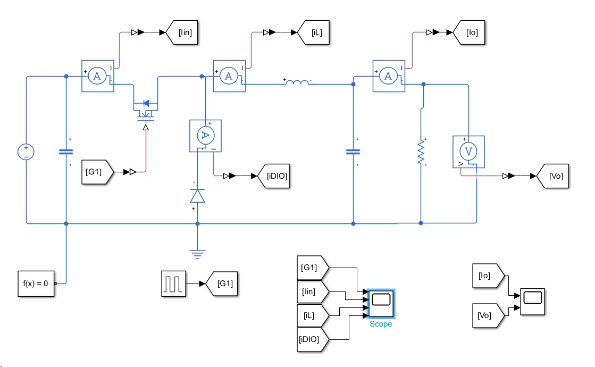

仿真波形与输出电压：

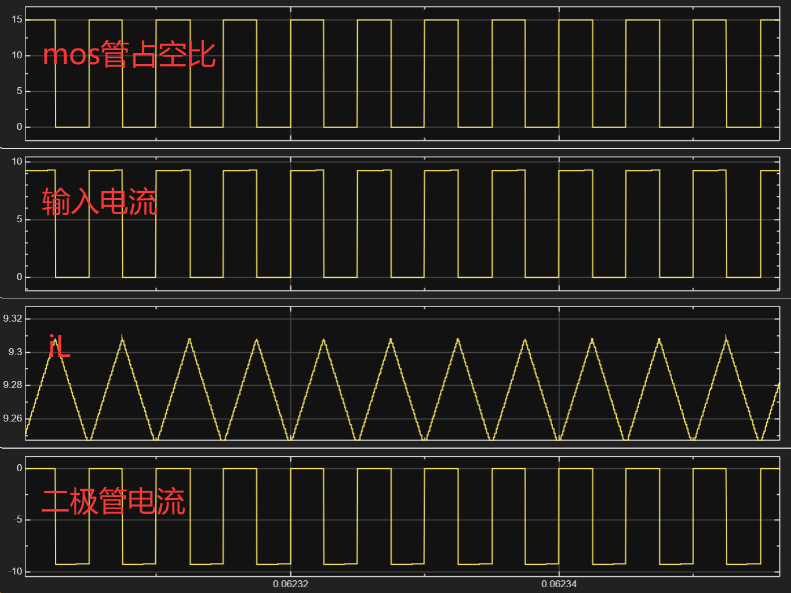

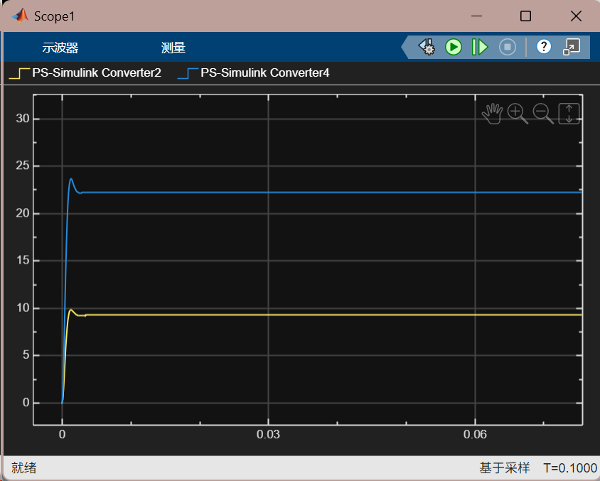

电流波形与前面的导通、关断分析一致。本次仿真输出未达到理想的 24 V；模型中 MOSFET 的导通电阻会产生额外压降。

### 3.2 同步 Buck 仿真

仿真模型：

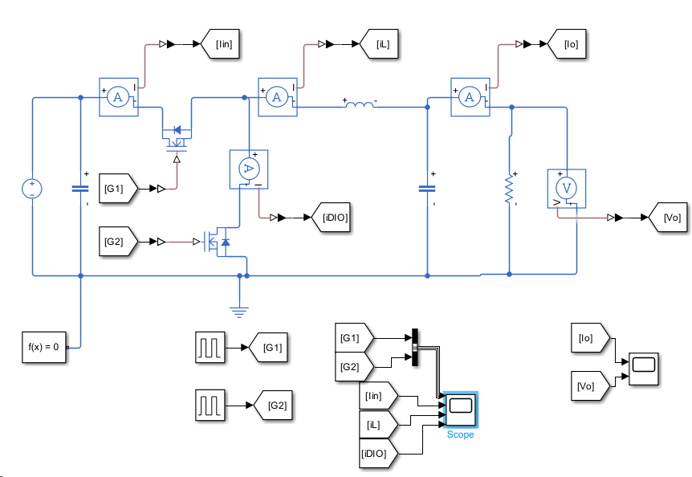

仿真波形与输出电压：

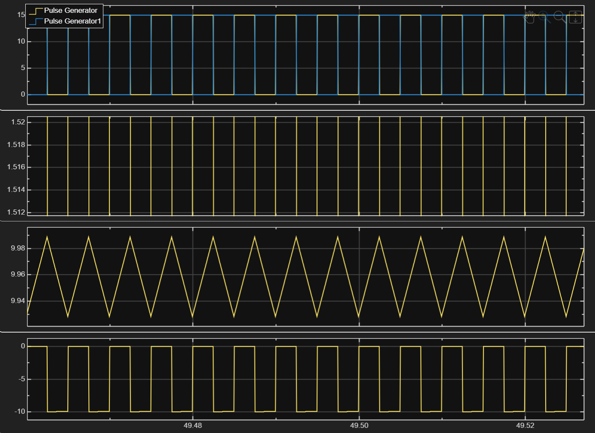

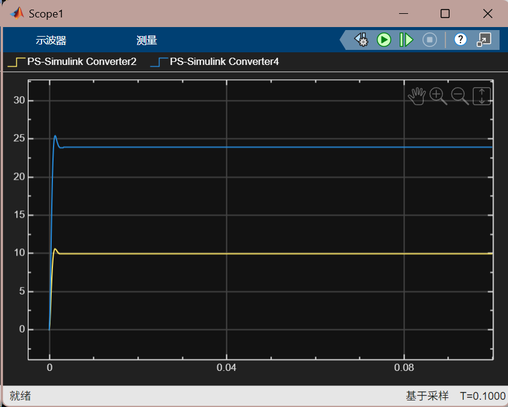

## 4. 参数计算

以下推导对应稳态、连续导通模式（CCM）。异步 Buck 考虑二极管压降 $V_d$，忽略开关管导通压降；同步 Buck 的简化式取 $V_d=0$，并忽略 MOSFET 导通损耗。

### 4.1 占空比计算

电感电流在开关导通期间上升、关断期间下降，变化斜率由电感两端的电压决定。

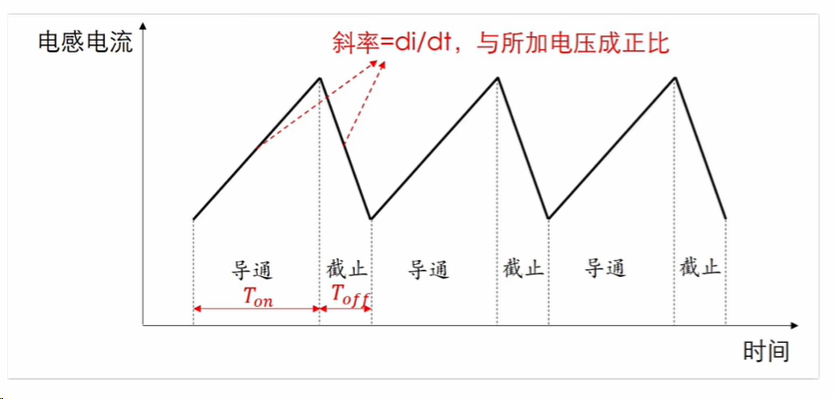

根据电感关系式：

$$
U=L\frac{\mathrm{d}i}{\mathrm{d}t}
$$

稳态时，电感一个周期内的净电流变化为零。因此，导通期间与关断期间满足伏秒平衡：

> 关键公式 ① · 伏秒平衡
>
> $$
> \boxed{\displaystyle (V_i-V_o)T_{\mathrm{on}}=(V_o+V_d)T_{\mathrm{off}}}
> $$

又已知开关周期：

$$
T=T_{\mathrm{on}}+T_{\mathrm{off}}=\frac{1}{f}
$$

可分别得到导通时间和关断时间：

$$
T_{\mathrm{on}}=\frac{V_o+V_d}{V_i+V_d}\cdot\frac{1}{f}
$$

$$
T_{\mathrm{off}}=\frac{V_i-V_o}{V_i+V_d}\cdot\frac{1}{f}
$$

占空比是导通时间占整个开关周期的比例：

> 关键公式 ② · 占空比
>
> $$
> \boxed{\displaystyle D=\frac{T_{\mathrm{on}}}{T}=\frac{V_o+V_d}{V_i+V_d}}
> $$

### 4.2 电感电流纹波计算

电感电流纹波 $\Delta I_L$ 是一个开关周期内电感电流的**峰峰值**，如下图所示。

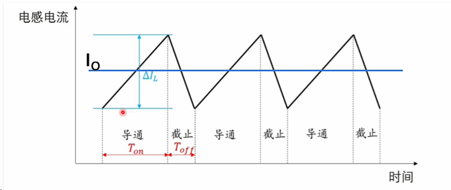

开关导通时，电感电压为：

$$
U=V_i-V_o
$$

导通时间为：

$$
\mathrm{d}t=T_{\mathrm{on}}
=\frac{V_o+V_d}{V_i+V_d}\cdot\frac{1}{f}
$$

由 $U=L\mathrm{d}i/\mathrm{d}t$，得到导通期间的电流增量：

$$
\mathrm{d}i=\frac{U\cdot\mathrm{d}t}{L}
=\frac{V_o+V_d}{V_i+V_d}\cdot\frac{1}{fL}(V_i-V_o)
=\Delta I_L
$$

因此，异步 Buck 的电感电流纹波为：

> 关键公式 ③ · 电感电流纹波（峰峰值）
>
> $$
> \boxed{\displaystyle \Delta I_L=\frac{V_o+V_d}{fL}\cdot\frac{V_i-V_o}{V_i+V_d}}
> $$

同步 Buck（$V_d=0$）时，简化为：

$$
\Delta I_L=\frac{V_o}{fL}\left(1-\frac{V_o}{V_i}\right)
$$

#### 电感峰值电流

电感电流围绕平均值 $I_o$ 波动，因此峰值电流为：

$$
I_{LP}=I_o+\frac{\Delta I_L}{2}
$$

代入纹波表达式：

$$
I_{LP}=I_o+\frac{V_o+V_d}{2fL}\cdot\frac{V_i-V_o}{V_i+V_d}
$$

同步 Buck（$V_d=0$）时：

$$
I_{LP}=I_o+\frac{V_o}{2fL}\left(1-\frac{V_o}{V_i}\right)
$$

#### 根据纹波目标确定电感量

稳态时，平均电感电流等于输出电流：

$$
I_L=I_o
$$

选择电感量时，仍使用前面的纹波关系：

> 设计依据 · 由纹波反推电感量
>
> $$
> \boxed{\displaystyle \Delta I_L=\frac{V_o+V_d}{fL}\cdot\frac{V_i-V_o}{V_i+V_d}}
> $$

将纹波峰峰值取为平均电感电流的 20%～40%：

$$
\Delta I_L=(0.2\sim0.4)I_L
$$

代入 $I_L=I_o$，得到异步 Buck 的电感量：

> 关键公式 ④ · 异步 Buck 电感量
>
> $$
> \boxed{\displaystyle L=\frac{V_o+V_d}{f(0.2\sim0.4)I_o}\cdot\frac{V_i-V_o}{V_i+V_d}}
> $$

同步 Buck（$V_d=0$）时：

> 关键公式 ⑤ · 同步 Buck 电感量
>
> $$
> \boxed{\displaystyle L=\frac{V_o}{f(0.2\sim0.4)I_o}\left(1-\frac{V_o}{V_i}\right)}
> $$

### 4.3 输出电压纹波计算

输出电压纹波反映输出的稳定性。电感电流分为负载电流和电容电流，电容交替充电、放电；图中还标出了电容的等效串联电阻（ESR）。

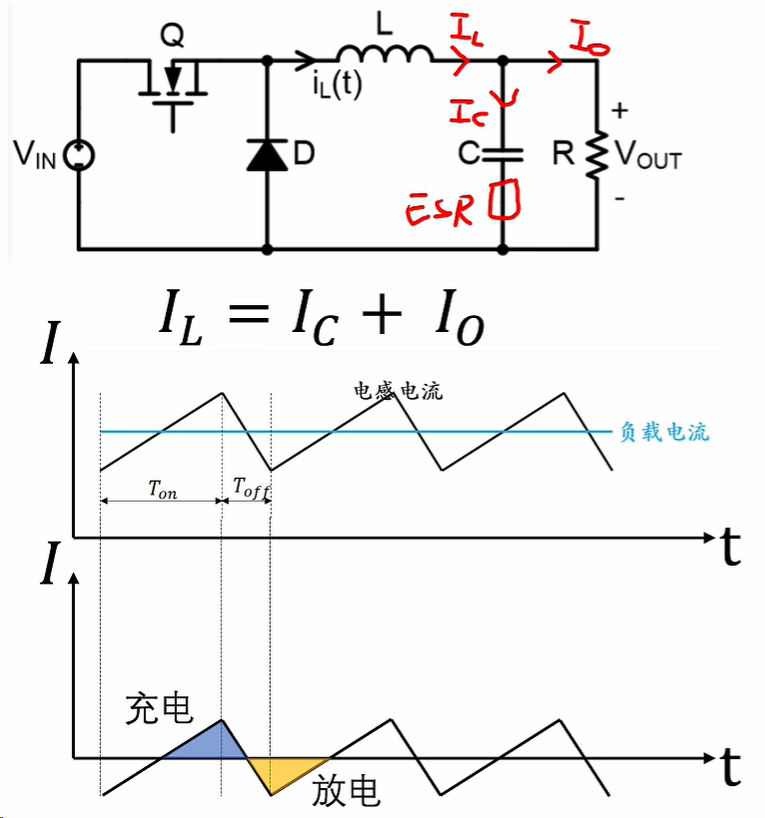

输出电压纹波由电容充放电引起的电压变化和 ESR 上的压降组成。下图给出了两部分的计算过程：

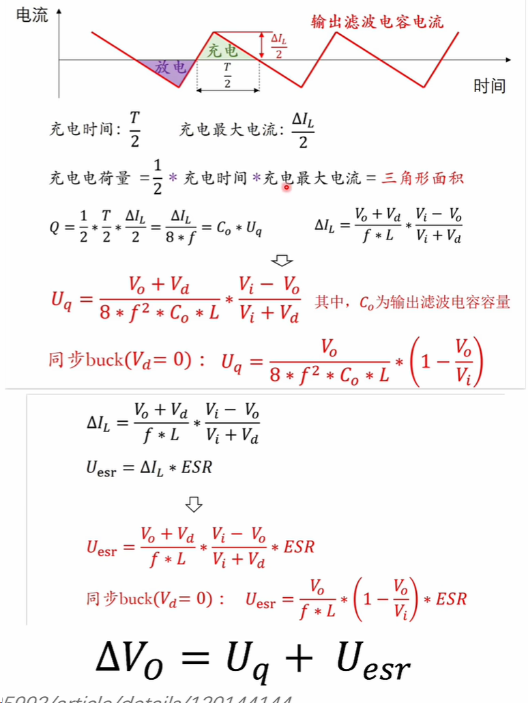
