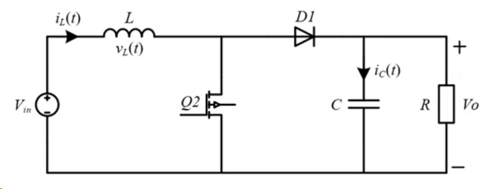
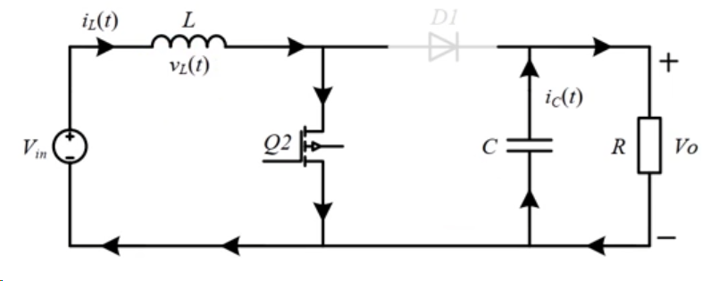
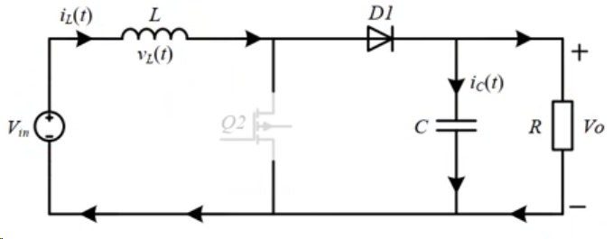
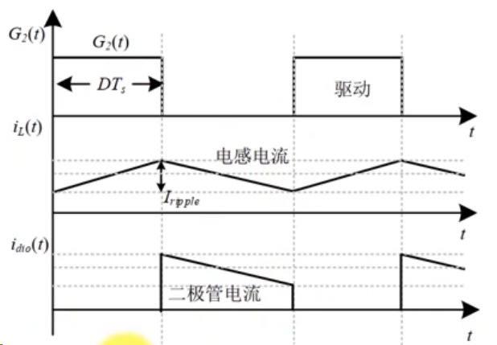
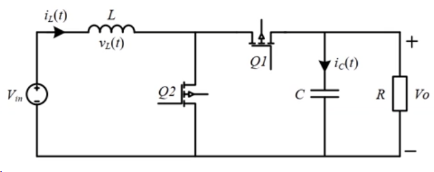
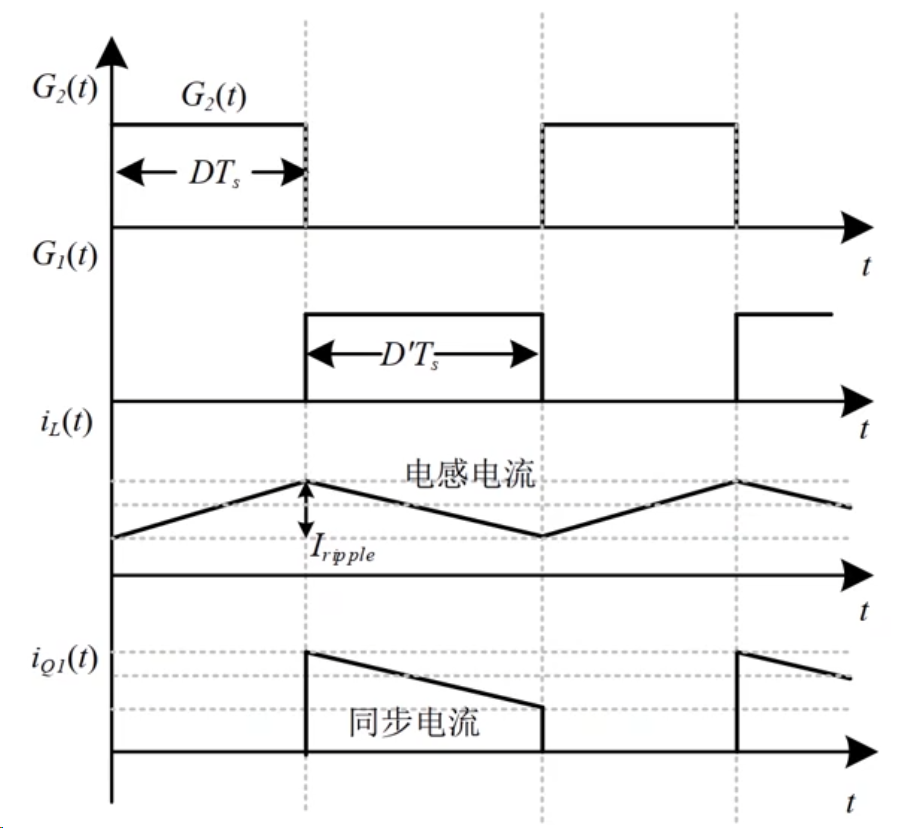
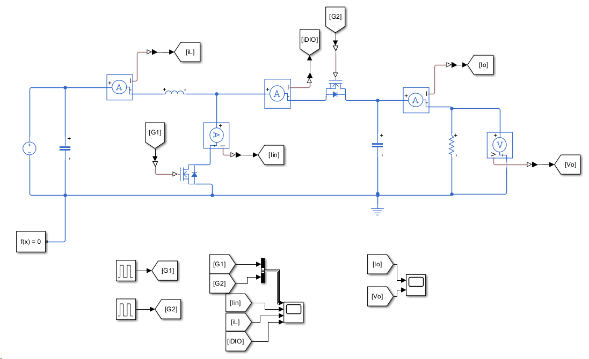
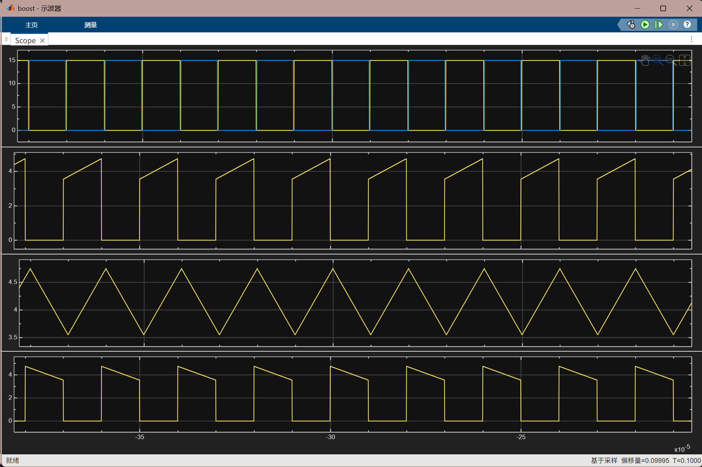
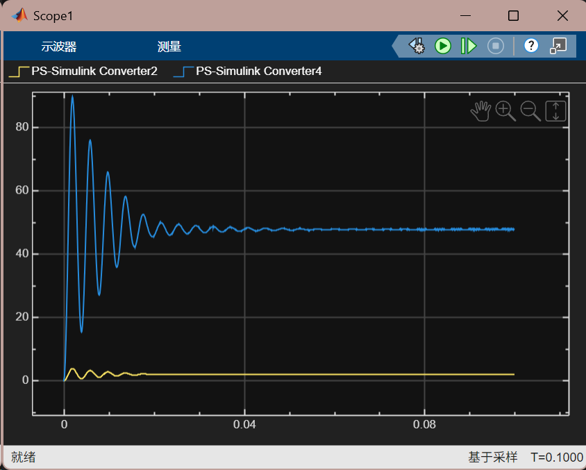

## 1. 基本拓扑

D1 为续流二极管，C 为输出滤波电容，R 为负载电阻。

根据 Q2 的开关状态，将 Boost 电路分为两种工作状态。以下分析采用理想器件，忽略开关管与二极管的压降，并假设电路处于稳态、连续导通模式（CCM）。图中的 Vin、Vo 分别对应下文的 $V_{\mathrm{in}}$、$V_o$。

### 1.1 工作模式 1：Q2 导通，电感储能

Q2 导通时，MOSFET 近似为导线，此时 D1 截止，输出电容 C 向负载供电。

此时，输入电源向电感储能，电感两端的电压为：

$$
V_{\mathrm{in}}=L\frac{\mathrm{d}i_L}{\mathrm{d}t}
$$

因此，电感电流 $i_L$ 线性上升。

### 1.2 工作模式 2：Q2 关断，电感释放能量

Q2 关断后，由于电感电流不能突变，D1 导通，电感电流经 D1 流向输出侧。

此时，电感释放能量，电感两端的电压为：

$$
V_{\mathrm{in}}-V_o=L\frac{\mathrm{d}i_L}{\mathrm{d}t}
$$

输入电源与电感共同向输出侧供能，既向负载供电，也补充电容在上一阶段释放的能量。由于 $V_o>V_{\mathrm{in}}$，电感电流线性下降。

工作波形如下：

设 Q2 的导通占空比为 $D$，开关周期为 $T_s$，则导通时间为 $DT_s$，关断时间为 $(1-D)T_s$。根据电感的伏秒平衡：

$$
D V_{\mathrm{in}}+(1-D)(V_{\mathrm{in}}-V_o)=0
$$

因此，理想稳态、连续导通模式下，Boost 的输入输出电压与占空比满足：

$$
\frac{V_o}{V_{\mathrm{in}}}=\frac{1}{1-D},\qquad 0<D<1
$$

### 1.3 同步整流 Boost 电路

D1 的正向压降会产生导通损耗。同步整流使用导通电阻较低的 MOSFET 替代 D1，以降低这一部分损耗。

同步整流的工作波形如下：

## 2. Simulink 仿真

直接采用同步 Boost 电路进行仿真，模型如下：

仿真波形如下：

输出电压与电流波形如下：

